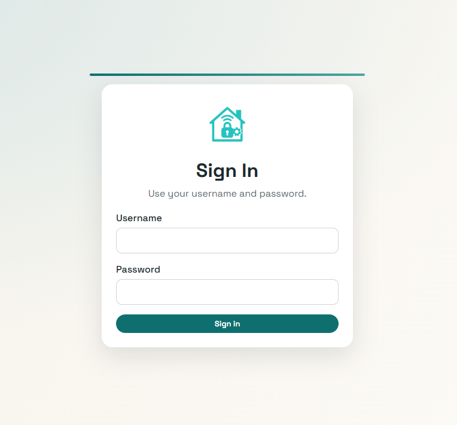
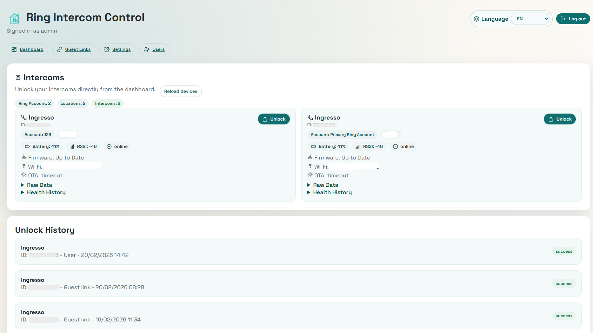
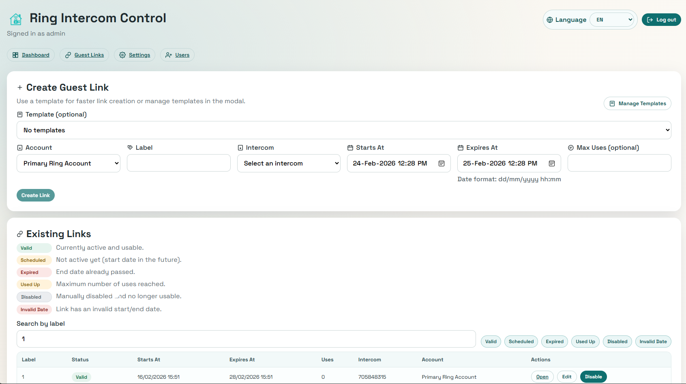
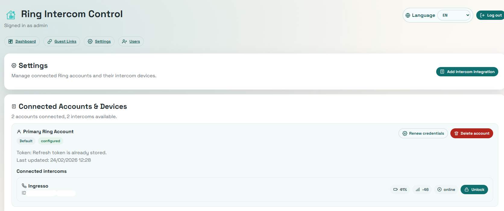
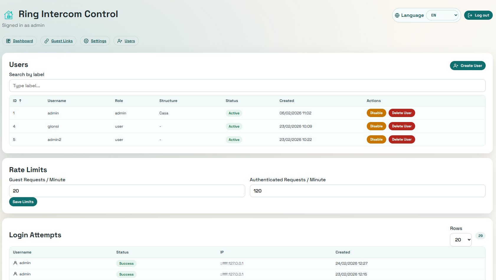

<p align="center">
  
</p>

# Ring Intercom Control

Self-hosted web app to manage Ring Intercom access for B&B and small hospitality workflows.

Main use case: create temporary guest links (check-in/check-out window) so guests can unlock the door only during their stay.

Supported languages: English, Italian, Spanish, German.

## Documentation

Most project details are maintained in Docusaurus:

- Docs source: `website/`
- Intro: `website/docs/intro.md`
- Architecture: `website/docs/architecture.md`
- API (generated from backend docstrings): `website/docs/api/reference.md`
- Deployment: `website/docs/deployment.md`
- Development: `website/docs/development.md`
- Security: `website/docs/security.md`
- Contributing: `website/docs/contributing.md`

Published docs:
- `https://mrgionsi.github.io/ring-intercom-control/`

## Key Capabilities

- Ring account integration (single or multiple accounts per user)
- Intercom unlock from web dashboard
- Guest links with start/end window and max-use limit
- Admin/user role model
- Audit trails for unlocks and login attempts

## UI Preview

### Login


### Dashboard


### Guest Links


### Settings


### Users (Admin)


## Quick Start

Prerequisite: Node.js `24.14.1` or newer. The repository includes `.nvmrc`
with the CI/docs baseline (`24.14.1`).

```bash
cd backend && npm install
cd ../frontend && npm install
```

```bash
cd backend
cp .env.example .env
openssl rand -hex 32
openssl rand -base64 32
npm run hash-password -- yourAdminPassword
```

If you prefer not to use `npm run`, generate the same bcrypt hash directly with
Node after `backend/npm install`:

```bash
node -e "const bcrypt=require('./backend/node_modules/bcryptjs'); console.log(bcrypt.hashSync('yourAdminPassword', 12));"
```

Set the generated values in `backend/.env`:

```env
ADMIN_USERNAME=admin
ADMIN_PASSWORD_HASH=<paste the hash from `npm run hash-password -- yourAdminPassword`>
SESSION_SECRET=<paste the hex value from `openssl rand -hex 32`>
MASTER_KEY=<paste the Base64 value from `openssl rand -base64 32`>
```

`MASTER_KEY` must be a Base64-encoded 32-byte key because the backend uses
AES-256-GCM to encrypt Ring refresh tokens.

If you place `ADMIN_PASSWORD_HASH` directly in Docker Compose YAML, escape each
`$` as `$$`. Bcrypt hashes contain `$` separators and Docker Compose treats `$`
as variable interpolation syntax. In Portainer stack deployments, keep the same
rule and escape the bcrypt hash as `$$` there as well.

```bash
cd backend
npm run dev
```

```bash
cd frontend
npm run dev
```

App URLs:

- Frontend: `http://localhost:5173`
- Backend: `http://localhost:3001`

For complete setup, security, Docker, and CI/CD instructions, use the Docusaurus docs above.

## Docker Deployment

The project supports containerized deployment for both backend and frontend.

- Backend image: `backend/Dockerfile`
- Frontend image: `frontend/Dockerfile`
- Compose stack: `docker-compose/docker-compose.yml`
- Env template: `docker-compose/.env.example`

### Frontend Container (Standalone)

Build:

```bash
docker build ./frontend -t mrgionsi/ring-intercom-control-frontend:0.1.0-beta
```

Run:

```bash
docker run --rm -p 5173:5173 \
  -e PORT=5173 \
  -e BACKEND_URL=http://host.docker.internal:3001 \
  mrgionsi/ring-intercom-control-frontend:0.1.0-beta
```

Notes:

- `BACKEND_URL` is optional. If set, `/api/*` requests are proxied to backend.
- `host.docker.internal` works by default on Docker Desktop (Windows/macOS). On Linux, add:
  - `--add-host=host.docker.internal:host-gateway`
- Health endpoint inside container: `GET /health` returns `{ "ok": true }`.
- Static cache policy:
  - `index.html`: `no-cache`
  - `/assets/*`: `public, max-age=31536000, immutable`

### Docker Compose (Backend + Frontend)

Files:

- `docker-compose/docker-compose.yml`
- `docker-compose/.env`
- `docker-compose/docker-compose.portainer.yml`

Run:

```bash
cd docker-compose
cp .env.example .env
docker compose up -d
```

Environment notes:

- `NODE_ENV=production`: use for real deployments. Cookies are treated as
  secure in current releases, so pair this with HTTPS.
- `NODE_ENV=development`: useful for local or private-LAN HTTP testing when you
  are not terminating TLS yet.
- `TRUST_PROXY=0`: use this when requests reach the backend directly, without a
  reverse proxy in front of it.
- `TRUST_PROXY=1`: use this when the backend sits behind one trusted proxy hop,
  for example Traefik. This affects `req.ip`, login audit IPs, rate limiting,
  and secure-cookie handling behind HTTPS termination.
- `CLIENT_ORIGIN`: set this to the browser-facing frontend URL, for example
  `http://192.168.1.50:5173`.
- `BACKEND_URL` in the frontend container should usually point to the Docker
  service name, for example `http://backend:3001`, not the host LAN IP.

Stop:

```bash
cd docker-compose
docker compose down
```

Container logs are written to stdout/stderr, so they are visible with:

```bash
docker logs ring-intercom-backend
docker logs ring-intercom-frontend
```

### Portainer + Traefik

Use `docker-compose/docker-compose.portainer.yml` when exposing only the
frontend through Traefik and keeping the backend private on the internal
`ring-intercom` Docker network.

Create the external Docker networks first if they do not already exist:

```bash
docker network create ring-intercom
docker network create traefik_default
```

Portainer notes:

- Import or paste `docker-compose/docker-compose.portainer.yml` into a stack.
- Add the required environment variables in Portainer.
- Set `TRUST_PROXY=1` when running behind Traefik.
- `frontend` is attached to both `traefik_default` and `ring-intercom`.
- `backend` is attached only to `ring-intercom` and is not exposed publicly.
- `CLIENT_ORIGIN` should be the public browser URL, for example
  `https://intercom.srv.home.gionsi.me`.
- `BACKEND_URL` should stay internal as `http://backend:3001`.
- In Portainer stack deployments, escape bcrypt `$` characters as `$$` for
  `ADMIN_PASSWORD_HASH`.

## Validation and QA

### Build Checks

```bash
cd backend && npm run build
cd ../frontend && npm run build
```

### Smoke Tests

PowerShell:

```powershell
scripts/smoke-test.ps1
```

Bash:

```bash
scripts/smoke-test.sh
```

Optional authenticated smoke checks:

- `SMOKE_USERNAME=<username>`
- `SMOKE_PASSWORD=<password>`
- `SMOKE_BASE_URL=http://localhost:3001`

### Security Audit

PowerShell:

```powershell
scripts/security-check.ps1
```

Bash:

```bash
scripts/security-check.sh
```

## Known Dependency Advisories

Current `npm audit` reports high-severity vulnerabilities in transitive dependencies:

- `ip` via `ring-client-api` -> `werift` / `werift-ice`; `ip@2.0.1` is still
  the latest published version and npm's fix path is a breaking downgrade of
  `ring-client-api`.

These are currently tracked and deferred until upstream fix availability.

The docs site currently reports moderate dev-server advisories through
Docusaurus' `webpack-dev-server` -> `sockjs` -> `uuid` dependency chain. The
static production docs build is successful, and npm reports no available
Docusaurus fix yet.

## Branching Model

- `main`: stable, production-ready branch
- `dev`: integration and pre-release branch
- `feature/*`: short-lived implementation branches
- `hotfix/*`: emergency fixes from `main`

## Roadmap

- Optional managed DB migration path (Supabase/Postgres)
- Extended automated test coverage (API + UI)

## License

- See `LICENSE`.

## Community

- Contribution guide: `CONTRIBUTING.md`
- Security policy: `SECURITY.md`
- Support: `SUPPORT.md`
- Issues: `https://github.com/mrgionsi/ring-intercom-control/issues`
