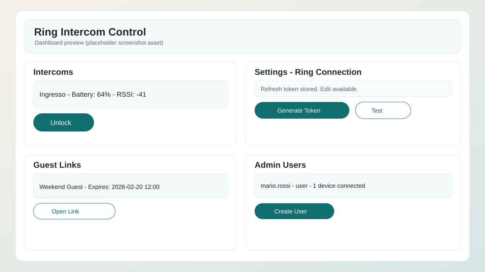

# ring-intercom-control

`ring-intercom-control` is a self-hosted web application to manage Ring Intercom access for short-term rentals and small hospitality operations.

It supports secure Ring token management, one-click unlock from web, expiring guest links, and admin user/device oversight.

## Features

### Access Control
- Ring refresh token storage encrypted with AES-256-GCM
- Ring token onboarding from GUI (email/password + 2FA)
- Refresh token validation before save
- Ring token update/edit flow per user
- Manual unlock from dashboard
- Guest unlock links with start/end date range
- Optional maximum uses per guest link

### User and Admin Management
- Role model: `admin` and `user`
- Admin can create, edit, disable, and reset users
- Admin overview of users and devices (read-only for other users' devices)
- Users can manage only their own Ring integration and guest links

### Device Visibility
- Ring locations, intercom list, and camera/device list
- Battery, RSSI, OTA state, firmware, and Wi-Fi info when available
- Device health history snapshots per intercom
- Raw payload inspection for troubleshooting

### Security and Auditing
- Session-based auth with rotation at login
- CSRF protection for authenticated write routes
- Login lockout after 5 failed attempts (15 minutes)
- Request rate limits configurable in admin UI
- Unlock audit trail (user and guest sources)
- Login attempt audit trail

### UX and Internationalization
- Languages: English, Italian, Spanish, German
- Browser language auto-detection
- Live language switch without page reload
- Unified date display format across UI: `dd/mm/yyyy hh:mm`

## Application Screenshot



> Replace `docs/screenshots/app-overview.svg` with real UI screenshots anytime without changing README structure.

## Stack Details

### Backend
- Node.js 24+
- TypeScript
- Express
- Session auth (`express-session` + `connect-sqlite3`)
- Database access via `sqlite` wrapper with `sqlite3` driver
- Ring integration via `ring-client-api`

### Frontend
- React 18
- TypeScript
- Vite
- React Router
- i18next + react-i18next

### Data Storage
- SQLite file database (`backend/data.db`)
- SQLite session store (`backend/session.db`)

### CI/CD
- GitHub Actions workflow: `.github/workflows/ci.yml`
- Runs backend build, frontend build, and smoke tests on PR/push (`main`, `dev`)

<p align="left">
  
</p>

## Highlights

- `backend/` API server and data layer
- `frontend/` React web application
- `scripts/` security and smoke test utilities
- `.github/workflows/` CI pipelines
- `docs/screenshots/` README image assets

## Local Development

### Prerequisites
- Node.js 24+
- npm 10+
- Ring account with 2FA enabled

### 1) Install Dependencies

```bash
cd backend
npm install
cd ../frontend
npm install
```

### 2) Configure Backend Environment

```bash
cd backend
cp .env.example .env
```

Required env vars:

- `SESSION_SECRET`: secret used to sign and verify session cookies.
  - Minimum recommendation: 32+ random bytes.
  - Use a high-entropy value; do not reuse across environments.
  - Rotating it will invalidate active sessions (users must log in again).
- `MASTER_KEY`: base64-encoded 32-byte key for AES-256-GCM encryption of stored Ring refresh tokens.
  - Must decode to exactly 32 bytes.
  - If invalid length, backend startup fails by design.
  - Rotating it without data migration makes previously stored encrypted tokens undecryptable.
  - Keep it stable per environment unless you implement re-encryption migration.
- `ADMIN_USERNAME`: bootstrap admin username
- `ADMIN_PASSWORD_HASH`: bcrypt hash for admin password

Generate values:

```bash
# Generate MASTER_KEY (base64, exactly 32 bytes)
node -e "console.log(require('crypto').randomBytes(32).toString('base64'))"

# Generate SESSION_SECRET (hex string from 64 random bytes)
node -e "console.log(require('crypto').randomBytes(64).toString('hex'))"

cd backend
npm run hash-password -- yourStrongPassword
```

Quick validation for `MASTER_KEY` length:

```bash
node -e "const k=process.env.MASTER_KEY||''; console.log(Buffer.from(k,'base64').length)"
```

Expected output: `32`

### 3) Run App in Dev Mode

Terminal 1:

```bash
cd backend
npm run dev
```

Terminal 2:

```bash
cd frontend
npm run dev
```

Default URLs:

- Frontend: `http://localhost:5173`
- Backend: `http://localhost:3001`

### 4) Configure Ring Integration

Preferred:

1. Open `Settings -> Ring Connection`
2. Enter Ring email/password
3. Enter 2FA code (SMS or authenticator)
4. Save refresh token

Alternative CLI:

```bash
cd backend
npx -p ring-client-api ring-auth-cli
```

Paste generated refresh token in `Settings -> Ring Connection`.

## Docker

### Frontend Image

Build:

```bash
docker build ./frontend -t mrgionsi/ring-intercom-control-frontend:0.1.0-beta
```

Run:

```bash
docker run --rm -p 5173:5173 \
  -e PORT=5173 \
  -e BACKEND_URL=http://host.docker.internal:3001 \
  mrgionsi/ring-intercom-control-frontend:0.1.0-beta
```

Notes:

- `BACKEND_URL` is optional. If set, `/api/*` requests are proxied to backend.
- `host.docker.internal` works by default on Docker Desktop (Windows/macOS). On Linux, add:
  - `--add-host=host.docker.internal:host-gateway`
- Health endpoint inside container: `GET /health` returns `{ "ok": true }`.
- Static cache policy:
  - `index.html`: `no-cache`
  - `/assets/*`: `public, max-age=31536000, immutable`

### Docker Compose (Backend + Frontend)

Files:

- `docker-compose/docker-compose.yml`
- `docker-compose/.env`

Run:

```bash
cd docker-compose
docker compose up -d
```

Stop:

```bash
cd docker-compose
docker compose down
```

## Validation and QA

### Build Checks

```bash
cd backend && npm run build
cd ../frontend && npm run build
```

### Smoke Tests

PowerShell:

```powershell
scripts/smoke-test.ps1
```

Bash:

```bash
scripts/smoke-test.sh
```

Optional authenticated smoke checks:

- `SMOKE_USERNAME=<username>`
- `SMOKE_PASSWORD=<password>`
- `SMOKE_BASE_URL=http://localhost:3001`

### Security Audit

PowerShell:

```powershell
scripts/security-check.ps1
```

Bash:

```bash
scripts/security-check.sh
```

## Known Dependency Advisories

Current `npm audit` reports high severity vulnerabilities in transitive dependencies:

- `ip` via `ring-client-api` (fix path requires breaking downgrade)
- `tar` via `sqlite3` / `node-gyp` (fix path requires breaking downgrade)

These are currently tracked and deferred until upstream fix availability and the planned DB migration.

## Branching Model

- `main`: stable, production-ready branch
- `dev`: integration and pre-release branch
- `feature/*`: short-lived implementation branches
- `hotfix/*`: emergency fixes from `main`

## Roadmap

- Optional managed DB migration path (Supabase/Postgres)
- Extended automated test coverage (API + UI)

## License

MIT
